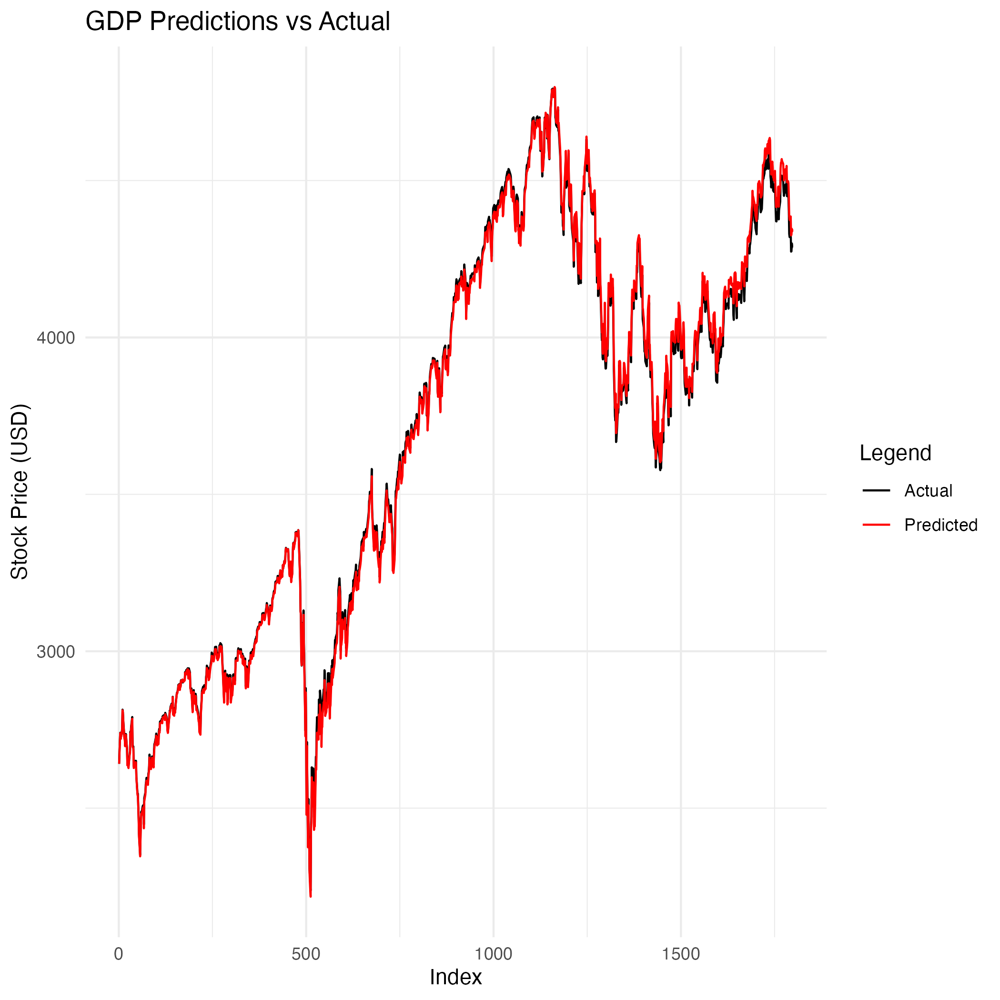

# Results
## IBM

**Loss**: 5.087766e-05
**Mean Absolute Error (MAE)**: 0.005555241

 
 

## Apple

 

## American Express

 

## JPMorgan Chase

 

## Exxon Mobil

 

## Occidental Petroleum

 

## Financial Sector Index

 

## Technology Sector Index

 

## Energy Sector Index

 

## GDP

 

## Unemployment Rate

 

## SP500 Index

