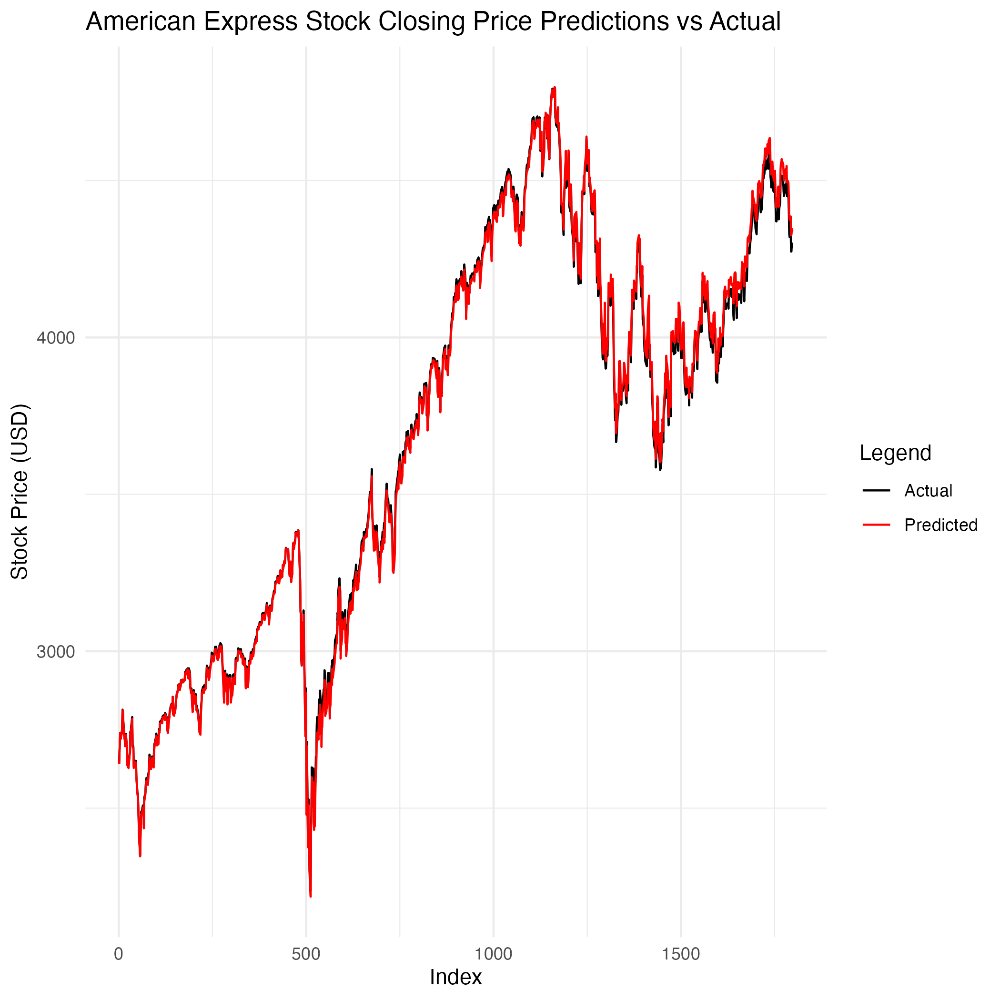

# Results

Here is a summary of results in terms of visualizations and metrics used to evaluate the models.
Overall, the low loss and MAE values indicate that the LSTM model is performing well in predicting stock prices. These metrics demonstrate that the model has effectively learned from the training data and is capable of making accurate predictions on unseen data. Model's predictions are extremely close to the actual values, see visualizations below.

## IBM

**Loss:** 5.087766e-05
**Mean Absolute Error (MAE):** 0.005555241  

 
 

## Apple

**Loss:** 3.08333e-05
**Mean Absolute Error (MAE):** 0.004030683  

 
 

## American Express

**Loss:** 9.61576e-05
**Mean Absolute Error (MAE):** 0.007796402  

 
 

## JPMorgan Chase

**Loss:** 1.260871e-05
**Mean Absolute Error (MAE):** 0.002806442  

 
 

## Exxon Mobil

**Loss:** 2.518778e-05
**Mean Absolute Error (MAE):** 0.003764171  

 
 

## Occidental Petroleum

**Loss:** 8.370064e-05
**Mean Absolute Error (MAE):** 0.007579344  

 
 

## Financial Sector Index

**Loss:** 9.703339e-05
**Mean Absolute Error (MAE):** 0.007811092  

 
 

## Technology Sector Index

**Loss:** 0.0001026064
**Mean Absolute Error (MAE):** 0.006956598  

 
 

## Energy Sector Index

**Loss:** 4.854473e-05
**Mean Absolute Error (MAE):** 0.005283509  

 
 

## GDP

**Loss:** 0.0005945606
**Mean Absolute Error (MAE):** 0.02028712  

 
 

## Unemployment Rate

**Loss:** 8.883823e-05
**Mean Absolute Error (MAE):** 0.004068905  

 
 

## SP500 Index

**Loss:** 1.07644e-05
**Mean Absolute Error (MAE):** 0.002600507  

 
 
